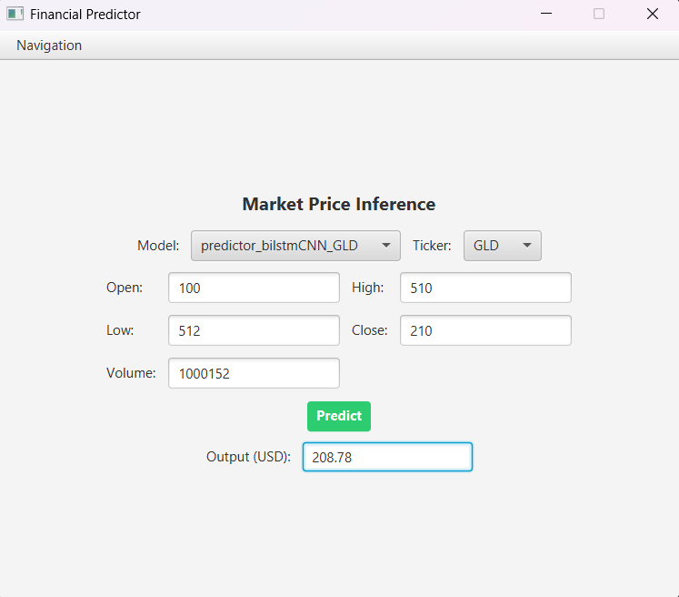

# Gold Price Predictor (BSP3): A Hybrid Bi-LSTM & CNN Financial Forecasting System

## Overview
This project is a sophisticated financial time-series forecasting system specifically designed for Gold (GLD) price prediction. It integrates a high-performance Python-based deep learning engine with a responsive JavaFX graphical interface, demonstrating advanced Cross-Language System Integration.

The system uses an **Early Fusion** approach, combining market technical indicators with sentiment data to provide a holistic view of price movements.

The obtained model is capable of successfully predicting next-day closing price for test years 2021-2022, but fails further due to the skyrocketing prices in the recent years. A whitepaper is also provided, describing technical details of the project (`project_report.pdf`).

## Key Features
*   **Hybrid Deep Learning Architecture:**
    *   **CNN Branch:** Utilizes 1D-Convolutional layers for automated feature extraction and noise reduction from raw financial data.
    *   **Bi-LSTM Branch:** Employs Bidirectional Long Short-Term Memory networks to capture complex, multi-scale temporal dependencies.
    *   **Attention Mechanism:** An optional self-attention layer that helps the model focus on the most relevant days in the input sequence.
*   **Dual-Core Integration:** 
    *   **Java Brain:** A JavaFX-based dashboard for system management and real-time visualization.
    *   **Python Engine:** A PyTorch-powered backend for data fetching, training, and inference.
    *   **Socket Bridge:** Custom communication protocol for seamless data exchange between the Java and Python environments.
*   **Comprehensive Evaluation Suite:**
    *   **Financial Backtesting:** Simulates trading strategies with configurable transaction fees, calculating **Sharpe Ratios**, **Equity Curves**, and **Maximum Drawdown**.
    *   **Performance Metrics:** Tracks RMSE, MAE, Directional Accuracy, and Epsilon Accuracy.
*   **Model Interpretability (XAI):**
    *   **Saliency Maps:** Visualizes which specific features drive model predictions.
    *   **Permutation Importance:** Ranks features by their impact on error when shuffled.
    *   **Temporal Attention Heatmaps:** Identifies which past time intervals are most critical for future predictions.



## Technical Stack
*   **Frameworks:** PyTorch (AI), JavaFX (GUI)
*   **Languages:** Java 17+, Python 3.10+
*   **Data Science:** NumPy, Pandas, Matplotlib
*   **Infrastructure:** Maven, `uv` (Fast Python Package Manager)

## Project Structure
- `java_brain/`: Java source code for the GUI and control logic.
- `python_engine/`: PyTorch model definitions, training scripts, and inference engine.
- `data/`: Local storage for models and processed datasets.
- `config/`: JSON-based configuration for assets and model tracking.

---

# BSP3 System Instructions

This project is a dual-engine application combining a Java Graphical Interface with a Python Inference Engine. Follow the steps below based on your operating system.

## Prerequisites

Regardless of your OS, you must have the following installed:

1. Java Runtime (JRE/JDK): Version 17 or 24 is required.
   * Check via: `java -version`
2. Internet Connection: Required for the first launch to download Python dependencies.

---

## Windows Instructions (Easy Launch)

We have bundled the uv package manager for Windows inside the bin/ folder to make setup automatic.

1. Download/Unzip the project folder.
2. Locate the file named launch.bat in the root folder.
3. Double-click launch.bat.
   * First Run: A console window will appear and download the required Python libraries. This may take 1-2 minutes depending on your connection.
   * Success: The Java GUI will open automatically once the environment is synchronized.

---

## macOS and Linux Instructions

Non-Windows users need to install the uv manager manually once before launching.

### 1. Install Dependencies
Open your terminal and run:

```bash
# Install uv (Astral Python Manager)
curl -LsSf [https://astral.sh/uv/install.sh](https://astral.sh/uv/install.sh) | sh

# Restart terminal or refresh your profile
source $HOME/.cargo/env
```

### 2. Set Permissions
Navigate to the BSP3 folder in your terminal and allow the script to execute:

```bash
chmod +x launch.sh
```

### 3. Launch
Run the script:
```
./launch.sh
```
---

## Project Structure Overview

* **java_brain/**: Contains the GUI and logic for managing the system.
* **python_engine/**: Contains the AI/ML logic and models.
* **data/**: Where your models and processed datasets are stored.
* **config/**: Contains tickers.json which tracks available models.
* **logs/**: Check here if anything goes wrong.


---

## Troubleshooting

### Python Module Errors
If the logs report ModuleNotFoundError (e.g., No module named 'dtale' or 'rich'):

1. Delete the `python_engine/.venv` folder.
2. Run the launcher (`launch.bat` or `launch.sh`) again. This forces uv to rebuild the environment from the `uv.lock` file.

### Port Conflicts
The system uses two ports (assigned dynamically). If you see a "Port already in use" error, ensure no other instances of the app are running. You can check your Task Manager for any stray `java.exe` or `python.exe` processes.

### Log Locations
If the application crashes, check the `/logs` folder:

* **java_gui.log**: Issues with the interface or buttons.
* **python_engine.log**: Issues with AI models or data processing.
* **comms.log**: Issues with the socket connection between Java and Python.

---

# Application Features & Capabilities

This document outlines the core functionalities of the **BSP3 Gold Price Predictor**, a dual-engine system designed for advanced financial forecasting and strategy validation.

---

## 1. Interactive Control Dashboard (JavaFX)
The application features a modern graphical interface that serves as the command center for all predictive operations:
- **Environment Management**: Automatic synchronization of Python dependencies using the `uv` manager.
- **Process Monitoring**: Real-time feedback from the Python inference engine via a dedicated communication bridge.
- **System Stability**: Built-in safety measures for graceful shutdowns and process management.

## 2. Advanced Deep Learning Models
The system doesn't just look at past prices; it understands complex patterns through a hybrid architecture:
- **Temporal Analysis**: Using **Bi-LSTM** (Bidirectional Long Short-Term Memory) to process price sequences in both forward and backward time directions, capturing context that standard models miss.
- **Spatial Feature Extraction**: **1D-CNN** layers treat time-series data like "images" to automatically identify local patterns and trends.
- **Self-Attention**: An integrated attention mechanism that allows the model to "focus" on specific critical dates or events within a 30-day window.

## 3. "Early Fusion" Sentiment Integration
Unlike basic predictors, this tool combines two distinct data streams:
- **Market Dynamics**: Real-time OHLC (Open, High, Low, Close) price data.
- **Sentiment Vectors**: Numerical representations of market sentiment, fused early in the model's architecture to influence price forecasts based on market "mood."

## 4. Professional Financial Backtester
The app includes a simulation environment to test how a model would have performed in real trading:
- **Strategy Simulation**: Executes Long/Short signals based on model-predicted price movements.
- **Transaction Costs**: Accurately accounts for trading fees and slippage to ensure realistic results.
- **Risk Metrics**: Automatically calculates critical investment KPIs:
    - **Sharpe Ratio**: Risk-adjusted return assessment.
    - **Equity Curve**: Visual growth of a $1,000 investment over time.
    - **Maximum Drawdown**: Measures the largest "peak-to-trough" decline.

## 5. Explainable AI (Interpretability)
Designed for transparency, the app provides tools to understand *why* a prediction was made:
- **Saliency Maps**: 2D heatmaps showing which specific technical indicators (e.g., Volume, RSI, Sentiment) were most influential.
- **Temporal Importance**: Graphs showing which days in the past sequence contributed most to today's forecast.
- **Error Distribution**: Histograms to identify if the model is consistently over-predicting or under-predicting (bias check).

## 6. Smart Data Handling
- **Custom Loss Functions**: Uses a specialized Huber Loss combined with structural penalties to ensure predicted OHLC values remain logically consistent (e.g., High is always greater than Low).
- **Log-Return Normalization**: Predicts percentage changes rather than raw prices, making the model more robust across different price scales.


(c) 2026 BSP3 Project, Erikas Kadiša